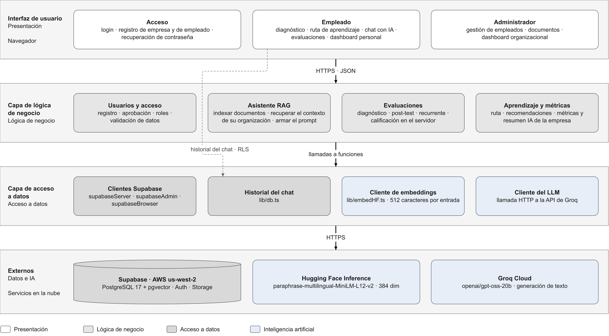

# Arquitectura en 3 capas — CyberChat

Vista clásica en tres capas: **UI** (presentación), **BLL** (lógica de negocio) y **DAL** (acceso a
datos). Los servicios de IA se tratan como una fuente externa más: la BLL decide cuándo usarlos y
la DAL se encarga de llamarlos.

| | Español | English |
|---|---|---|
| Editable (draw.io) | [arquitectura-3-capas.drawio](arquitectura-3-capas.drawio) | [arquitectura-3-capas.en.drawio](arquitectura-3-capas.en.drawio) |
| Imagen | [PNG](img/arquitectura-3-capas.es.png) · [SVG](img/arquitectura-3-capas.es.svg) | [PNG](img/arquitectura-3-capas.en.png) · [SVG](img/arquitectura-3-capas.en.svg) |

Las cuatro salidas se generan desde una sola definición con `node docs/tools/generar-diagramas.mjs`.

## Responsabilidad de cada capa

| Capa | Responsabilidad | En el código |
|---|---|---|
| **UI** | Mostrar pantallas, capturar lo que hace el usuario y llamar a la BLL | `app/**/page.tsx`, `components/` |
| **BLL** | Validar sesión y rol, aplicar reglas de negocio, orquestar el RAG, calificar evaluaciones y calcular métricas | `app/api/**/route.ts`, `lib/orgMetrics.ts`, `lib/learningPath.ts`, `lib/evaluationConfig.ts`, `lib/diagnosticBank.ts`, `lib/orgAdmin.ts`, `lib/validators/` |
| **DAL** | Leer y escribir en la base, el almacenamiento y la autenticación; llamar a los modelos de IA | `lib/supabaseServer.ts`, `lib/supabaseAdmin.ts`, `lib/supabaseBrowser.ts`, `lib/db.ts`, `lib/embedHF.ts` |

## Dónde entra la IA

| Servicio | Lo usa | Para qué |
|---|---|---|
| Hugging Face · `paraphrase-multilingual-MiniLM-L12-v2` | Asistente RAG · Aprendizaje y métricas | Convertir documentos, preguntas y temas débiles en vectores para la búsqueda semántica |
| Groq · `openai/gpt-oss-20b` | Asistente RAG | Responder preguntas con el contexto recuperado |
| Groq · `openai/gpt-oss-20b` | Aprendizaje y métricas | Recomendaciones personalizadas y resumen ejecutivo de la empresa |

## Desviaciones del modelo en el código actual

- **La UI salta la BLL en el chat.** El historial de conversaciones se lee y escribe desde el
  navegador con `lib/db.ts`, directo contra Supabase. La protección la dan las políticas RLS.
- **Groq no tiene un cliente propio.** La llamada HTTP a Groq está escrita dentro de cuatro rutas
  (`chat`, `dashboard`, `org-summary`, `recommendations`) en vez de estar en un módulo de la DAL
  como `embedHF.ts`.
