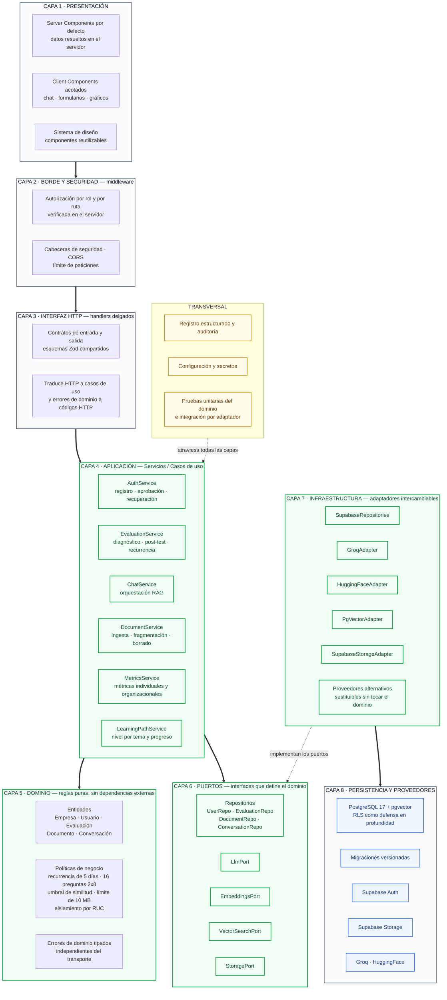

# Arquitectura por capas — CyberChat

Plataforma web de concientización en ciberseguridad para MYPES peruanas.
Stack: Next.js 16 (App Router) · React 19 · TypeScript · Supabase (PostgreSQL 17 + pgvector) · Groq · HuggingFace · Tailwind 4.

Este documento presenta la arquitectura en dos vistas separadas:

- **AS IS** — la arquitectura tal como está implementada hoy, incluyendo la deuda técnica identificada.
- **TO BE** — la arquitectura objetivo, con la separación de responsabilidades que corrige esa deuda.

Ambos diagramas se generan con Mermaid y son verificables contra el código fuente.

---

## 1. AS IS — Arquitectura implementada

Inventario real: 13 páginas, 19 rutas de API, 13 módulos en `lib/`, 5 esquemas de validación,
11 tablas en PostgreSQL, 1 función RPC en uso, 1 bucket de Storage y 2 servicios externos de IA.

```mermaid
flowchart TB
    classDef banda fill:#f8fafc,stroke:#475569,stroke-width:1.5px,color:#0f172a
    classDef deuda fill:#fef2f2,stroke:#dc2626,stroke-width:2px,color:#7f1d1d
    classDef datos fill:#f0fdf4,stroke:#16a34a,stroke-width:1.5px,color:#14532d
    classDef ext fill:#eff6ff,stroke:#2563eb,stroke-width:1.5px,color:#1e3a8a

    subgraph C1["CAPA 1 · PRESENTACIÓN — Navegador · React 19 · Tailwind 4 · 13 páginas"]
        direction LR
        V_PUB["Vistas públicas<br/>landing · login · register<br/>register/admin · register/employee<br/>forgot-password · reset-password"]
        V_APP["Vistas autenticadas<br/>Empleado: diagnostic · chat · dashboard<br/>Admin: manage · admin · org-dashboard"]
        V_DEUDA["Autorización por rol resuelta en el cliente<br/>dentro de cada page.tsx<br/>lib/db.ts accede directo a la base"]
    end

    subgraph C2["CAPA 2 · BORDE — middleware.ts"]
        direction LR
        MW["Refresco de cookies de sesión<br/>y exigencia de diagnóstico completado"]
        MW_GAP["Sin autorización por rol"]
    end

    subgraph C3["CAPA 3 · APLICACIÓN — 19 Route Handlers · runtime nodejs"]
        direction LR
        A_AUTH["Identidad y empleados<br/>register-admin · register-employee<br/>admin/employees"]
        A_RAG["Asistente RAG y documentos<br/>chat · documents · documents por id<br/>upload-and-process · reprocess"]
        A_EVAL["Evaluaciones, ruta y reportes<br/>diagnostic · diagnostic/questions · posttest<br/>quiz · recurring-test/status · learning-path<br/>dashboard · org-dashboard · export<br/>org-summary · recommendations"]
        A_MIX["Validación, reglas de negocio, SQL<br/>y llamadas de IA conviven<br/>dentro del mismo handler"]
    end

    subgraph C4["CAPA 4 · LÓGICA COMPARTIDA — lib/ · 13 módulos"]
        direction LR
        L_DOM["Reglas y catálogos<br/>orgMetrics · learningPath · orgAdmin<br/>evaluationConfig · diagnosticTopics<br/>diagnosticBank server-only"]
        L_VAL["Validación Zod y utilidades<br/>auth · employees · evaluation<br/>learningPath · shared<br/>csv · authErrors"]
        L_IA["embedHF<br/>cliente directo de HuggingFace"]
    end

    subgraph C5["CAPA 5 · ACCESO A DATOS — clientes Supabase"]
        direction LR
        D_SRV["supabaseServer<br/>anon + cookies · respeta RLS"]
        D_BRW["supabaseBrowser<br/>anon en navegador · respeta RLS"]
        D_ADM["supabaseAdmin · service_role<br/>omite RLS · 16 rutas y 2 módulos"]
    end

    subgraph C6["CAPA 6 · PERSISTENCIA — Supabase · PostgreSQL 17 + pgvector · 11 tablas"]
        direction LR
        DB_AUTH["Identidad<br/>Supabase Auth · auth.users<br/>user_metadata: rol · RUC · aprobación"]
        DB_EVAL["Evaluaciones y progreso<br/>diagnostic_results · quiz_results<br/>evaluation_attempts · posttest_questions<br/>seen_questions · learning_progress<br/>org_summaries · conversations · messages"]
        DB_RAG["Base documental<br/>documents · document_chunks<br/>vector 384 · índice HNSW<br/>RPC match_document_chunks_scoped<br/>Storage · bucket documents"]
        DB_OLD["RPC match_document_chunks<br/>sin uso en el código"]
    end

    subgraph C7["CAPA 7 · SERVICIOS EXTERNOS DE IA"]
        direction LR
        X_GROQ["Groq · qwen/qwen3.8-27b<br/>generación de texto"]
        X_HF["HuggingFace · all-MiniLM-L6-v2<br/>embeddings de 384 dimensiones"]
    end

    C1 ==> C2
    C2 ==> C3
    C3 ==> C4
    C4 ==> C5
    C5 ==> C6

    C1 -.-> C5
    C3 -.-> C7
    C4 -.-> C7

    class C1,C2,C3,C4,C5 banda
    class V_DEUDA,MW_GAP,A_MIX,D_ADM,DB_OLD deuda
    class DB_AUTH,DB_EVAL,DB_RAG datos
    class X_GROQ,X_HF ext
```



**Leyenda.**

- **Flecha gruesa** — dependencia entre capas contiguas: el flujo normal de la petición.
- **Flecha punteada** — dependencia que salta capas. Son las tres violaciones de la arquitectura por capas:
  1. `Capa 1 → Capa 5`: `lib/db.ts` escribe en `conversations` y `messages` desde el navegador, sin pasar por la API.
  2. `Capa 3 → Capa 7`: cuatro rutas invocan Groq directamente, sin una abstracción que permita sustituir el proveedor.
  3. `Capa 4 → Capa 7`: `lib/embedHF.ts` invoca HuggingFace directamente, con el mismo acoplamiento.
- **Nodos en rojo** — deuda arquitectónica verificada en el código. No son defectos funcionales: el sistema opera
  correctamente, pero esas decisiones concentran responsabilidades y dificultan la evolución y la prueba unitaria.

---

## 2. TO BE — Arquitectura objetivo

Arquitectura en capas con inversión de dependencias: el dominio no conoce la infraestructura.
Las dependencias apuntan siempre hacia adentro, y los proveedores externos se sustituyen sin tocar las reglas de negocio.



---

## 3. Brecha entre ambas vistas

| # | AS IS — situación actual | TO BE — situación objetivo | Principio | Estado |
|---|---|---|---|---|
| 1 | La lógica de negocio, las consultas SQL y las llamadas a la IA conviven dentro de los route handlers | Capa de servicios y casos de uso; handlers reducidos a traducir HTTP | Separación de responsabilidades | Issue #9 |
| 2 | Acceso a datos disperso mediante tres clientes de Supabase invocados desde cualquier capa | Repositorios tras interfaces definidas por el dominio | Inversión de dependencias | Issue #9 |
| 3 | Groq se invoca directamente desde cuatro rutas y HuggingFace desde `lib/embedHF.ts` | `LlmPort` y `EmbeddingsPort` con adaptadores intercambiables | Patrón Adaptador | Issue #11 |
| 4 | `supabaseAdmin` con `service_role` en 16 rutas: omite RLS y el aislamiento depende de filtros escritos a mano | Cliente por petición que respeta RLS; `service_role` restringido a operaciones administrativas justificadas | Mínimo privilegio · defensa en profundidad | Propuesto |
| 5 | El navegador escribe directamente en `conversations` y `messages` mediante `lib/db.ts` | Todo acceso a datos pasa por la API; el cliente no habla con la base | Encapsulamiento | Propuesto |
| 6 | La autorización por rol se resuelve en cada `page.tsx` del lado del cliente | RBAC centralizado en el middleware, verificado en el servidor | Seguridad en el servidor | Propuesto |
| 7 | Las reglas de negocio están dispersas y acopladas a la infraestructura, sin pruebas unitarias | Dominio puro y aislado, cubierto por pruebas unitarias | Testabilidad | Propuesto |
| 8 | Objetos de base de datos creados manualmente, documentados a posteriori | Migraciones versionadas en control de versiones | Reproducibilidad | Issue #18 |
| 9 | Persisten artefactos huérfanos, como la función `match_document_chunks` | Esquema sin elementos sin uso | Higiene del esquema | Propuesto |

---

## 4. Verificación del inventario

Los elementos del diagrama AS IS se obtuvieron del código y de la base de datos en producción:

```bash
find app -name "page.tsx"            # 13 páginas
find app/api -name "route.ts"        # 19 rutas de API
ls lib lib/validators                # 13 módulos + 5 esquemas
grep -rln "supabaseAdmin" app/ lib/  # 16 rutas + 2 módulos
grep -rln "supabaseBrowser" app/ lib/
grep -rn "api.groq.com" app/         # 4 rutas
```

```sql
select table_name from information_schema.tables
 where table_schema = 'public' and table_type = 'BASE TABLE';  -- 11 tablas
```
