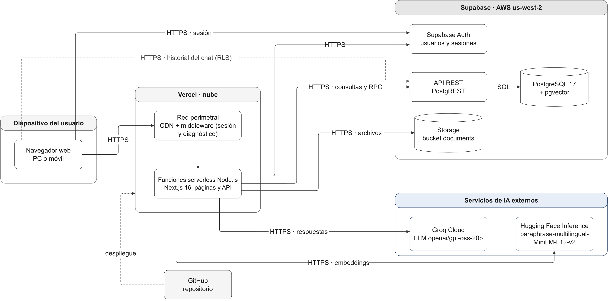

# Arquitectura física — CyberChat

Dónde se ejecuta cada parte del sistema y cómo se comunican. Toda la comunicación viaja por
HTTPS (TLS); ningún componente se conecta a la base de datos por TCP directo.

| | Español | English |
|---|---|---|
| Editable (draw.io) | [arquitectura-fisica.drawio](arquitectura-fisica.drawio) | [arquitectura-fisica.en.drawio](arquitectura-fisica.en.drawio) |
| Imagen | [PNG](img/arquitectura-fisica.es.png) · [SVG](img/arquitectura-fisica.es.svg) | [PNG](img/arquitectura-fisica.en.png) · [SVG](img/arquitectura-fisica.en.svg) |

Las cuatro salidas se generan desde una sola definición con `node docs/tools/generar-diagramas.mjs`.

| Nodo | Qué corre ahí |
|---|---|
| Navegador | Interfaz React; se conecta directo a Supabase solo para la sesión y el historial del chat (protegido por RLS) |
| Vercel · red perimetral | Entrega de archivos estáticos y middleware: refresca la cookie de sesión, cierra la de cuentas no activas y redirige al diagnóstico pendiente |
| Vercel · funciones | Renderizado de páginas y todas las rutas `/api`; guardan las claves secretas |
| Supabase | Autenticación, base de datos con búsqueda vectorial y almacenamiento de documentos |
| Groq | Genera las respuestas del asistente y los resúmenes organizacionales |
| Hugging Face | Convierte texto en vectores de 384 dimensiones para la búsqueda semántica |
| GitHub | Código fuente desde el que Vercel construye y publica la aplicación |
