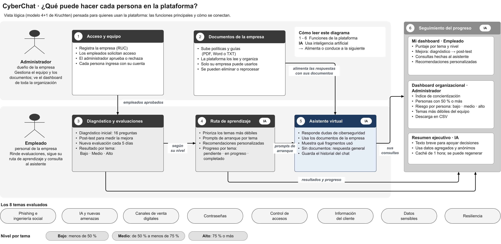

# Vista lógica — modelo 4+1

Vista lógica de CyberChat según Kruchten, *Architectural Blueprints — The "4+1" View Model of
Software Architecture* (IEEE Software 12(6), 1995). La vista lógica responde a los **requisitos
funcionales**: qué servicios presta el sistema a sus usuarios. Por eso el diagrama está pensado para
quienes usan la plataforma: muestra las funciones principales, quién las usa y cómo se conectan,
sin detalle técnico.

| | Español | English |
|---|---|---|
| Editable (draw.io) | [arquitectura-logica-4mas1.drawio](arquitectura-logica-4mas1.drawio) | [arquitectura-logica-4mas1.en.drawio](arquitectura-logica-4mas1.en.drawio) |
| Imagen | [PNG](img/arquitectura-logica-4mas1.es.png) · [SVG](img/arquitectura-logica-4mas1.es.svg) | [PNG](img/arquitectura-logica-4mas1.en.png) · [SVG](img/arquitectura-logica-4mas1.en.svg) |

Las cuatro salidas se generan desde una sola definición con `node docs/tools/generar-diagramas.mjs`.

## Cómo leer el diagrama

| Elemento | Significado |
|---|---|
| Bloques 1 a 6 | Funciones de la plataforma |
| Etiqueta **IA** | La función usa inteligencia artificial |
| Flecha | Una función alimenta o conduce a la siguiente |
| Franja superior | Lo que hace el administrador (dueño de la empresa) |
| Franja inferior | Lo que hace el empleado |

## Actores

| Actor | Rol en la plataforma |
|---|---|
| **Administrador** | Dueño de la empresa. Gestiona el equipo y los documentos, y ve el dashboard de toda la organización |
| **Empleado** | Personal de la empresa. Rinde evaluaciones, sigue su ruta de aprendizaje y consulta al asistente |

## Funciones

| # | Función | Qué hace | IA |
|---|---|---|---|
| 1 | **Acceso y equipo** | El administrador registra la empresa con su RUC; los empleados solicitan acceso y el administrador los aprueba o rechaza; cada persona ingresa con su cuenta | — |
| 2 | **Documentos de la empresa** | El administrador sube políticas y guías (PDF, Word o TXT); la plataforma las lee y organiza; solo su empresa puede usarlas; se pueden eliminar o reprocesar | — |
| 3 | **Diagnóstico y evaluaciones** | Diagnóstico inicial de 16 preguntas, post-test para medir la mejora y una nueva evaluación cada 5 días; resultado por tema en nivel bajo, medio o alto | — |
| 4 | **Ruta de aprendizaje** | Prioriza los temas más débiles, ofrece prompts de arranque por tema y recomendaciones personalizadas, y registra el progreso por tema (pendiente, en progreso, completado) | Sí |
| 5 | **Asistente virtual** | Responde dudas de ciberseguridad con los documentos de la empresa, muestra qué fragmentos usó, da una respuesta general si no hay documentos y guarda el historial del chat | Sí |
| 6 | **Seguimiento del progreso** | Dashboard personal del empleado, dashboard organizacional del administrador y resumen ejecutivo generado con IA | Sí |

## Cómo se conectan

| De | A | Qué pasa |
|---|---|---|
| 1 · Acceso y equipo | 3 · Diagnóstico y evaluaciones | Solo los empleados aprobados pueden rendir el diagnóstico |
| 2 · Documentos de la empresa | 5 · Asistente virtual | Los documentos alimentan las respuestas del asistente |
| 3 · Diagnóstico y evaluaciones | 4 · Ruta de aprendizaje | La ruta se arma según el nivel obtenido en cada tema |
| 4 · Ruta de aprendizaje | 5 · Asistente virtual | Cada tema abre el chat con un prompt de arranque |
| 3, 4 y 5 | 6 · Seguimiento del progreso | Resultados, progreso y consultas se reflejan en los dashboards |

## Seguimiento del progreso

| Panel | Para quién | Contenido |
|---|---|---|
| Mi dashboard | Empleado | Puntaje por tema y nivel, mejora del diagnóstico al post-test, consultas hechas al asistente y recomendaciones personalizadas |
| Dashboard organizacional | Administrador | Índice de concientización, personas con 50 % o más, riesgo por persona (bajo, medio, alto), temas más débiles del equipo y descarga en CSV |
| Resumen ejecutivo · IA | Administrador | Texto breve para apoyar decisiones, hecho con datos agregados y anónimos; se guarda en caché 1 hora y se puede regenerar |

## Temas y niveles

Los 8 temas evaluados: phishing e ingeniería social, IA y nuevas amenazas, canales de venta
digitales, contraseñas, control de accesos, información del cliente, datos sensibles y resiliencia.

| Nivel por tema | Rango |
|---|---|
| Bajo | Menos de 50 % |
| Medio | De 50 % a menos de 75 % |
| Alto | 75 % o más |

## Nota sobre el alcance

Kruchten señala que no toda arquitectura necesita las cinco vistas. En CyberChat la **vista de
proceso** aporta poco, porque cada petición se atiende en una función sin estado y sin procesos
concurrentes propios. Las demás vistas ya están documentadas: lógica (este documento y el modelo
C4 de [arquitectura-logica.md](arquitectura-logica.md)), desarrollo
([arquitectura-3-capas.md](arquitectura-3-capas.md)) y física
([arquitectura-fisica.md](arquitectura-fisica.md)).
