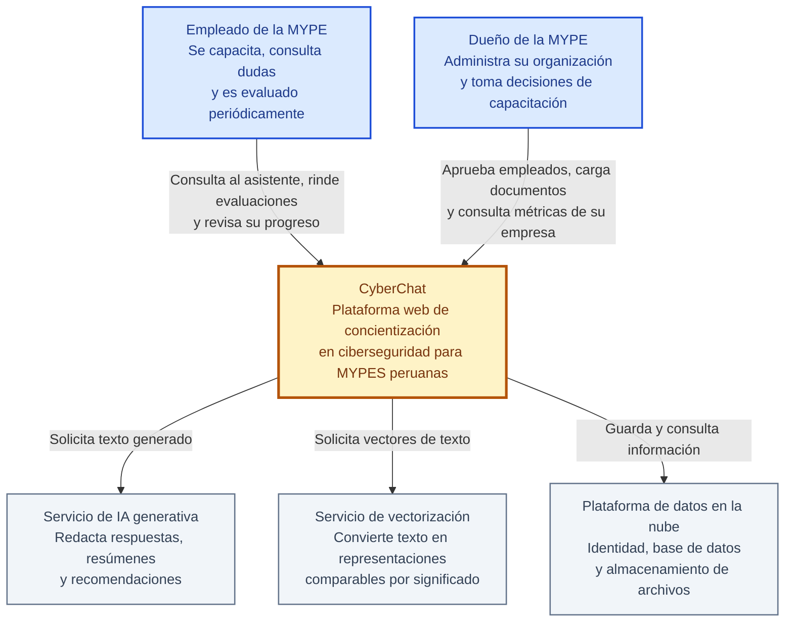
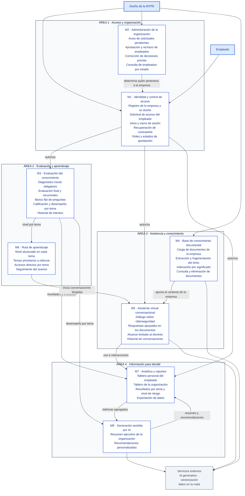

# Arquitectura lógica — CyberChat

Esta vista describe **cómo se organiza el software en módulos funcionales y cómo se relacionan entre sí**.
A diferencia de la arquitectura por capas (`arquitectura-capas.md`), que ordena el sistema por responsabilidad
técnica —presentación, aplicación, datos—, la arquitectura lógica se lee en términos del negocio: qué hace
cada parte del sistema y de qué depende. Está pensada para ser comprensible sin conocimiento técnico previo.

## Sobre el uso del modelo C4

Se adopta el **modelo C4** como marco conceptual, por ser un estándar reconocido para documentar arquitectura
de software en distintos niveles de detalle. De sus cuatro niveles se emplean dos:

| Nivel C4 | Uso en este documento | Motivo |
|---|---|---|
| **1 · Contexto** | Sí — diagrama 1 | Sitúa el sistema frente a sus usuarios y servicios de apoyo. Es el nivel menos técnico. |
| **2 · Contenedores** | No | Corresponde a la vista de despliegue y tecnología, ya cubierta por la arquitectura por capas. Incluirlo duplicaría el contenido. |
| **3 · Componentes** | Sí — diagrama 2 | Es exactamente la organización en módulos y sus relaciones. Se expresa en lenguaje funcional, no técnico. |
| **4 · Código** | No | Nivel de clases y funciones: excesivo para una memoria de tesis y volátil. |

**Los diagramas no se dibujan con la sintaxis `C4Context` de Mermaid.** Esa extensión está marcada como
experimental y carece de motor de posicionamiento: apila los elementos verticalmente y superpone las etiquetas
de relación sobre las cajas, lo que impide obtener una figura publicable. Se usa `flowchart`, que respeta la
semántica del modelo C4 y permite controlar la composición.

---

## 1. Nivel 1 · Contexto del sistema

Quién usa CyberChat y en qué servicios externos se apoya.

---

## 2. Nivel 3 · Módulos lógicos y sus relaciones

Los ocho módulos funcionales del sistema, agrupados en cuatro áreas.

---

## 3. Responsabilidad de cada módulo

| Módulo | Responsabilidad | Depende de | Alimenta a |
|---|---|---|---|
| **M1 · Identidad y control de acceso** | Establece quién es cada usuario, a qué empresa pertenece y qué puede hacer | M2 (estado de aprobación) | Todos los módulos |
| **M2 · Administración de la organización** | Permite al dueño decidir qué empleados acceden a la plataforma | M1 | M1 |
| **M3 · Evaluación del conocimiento** | Mide el nivel de concientización al inicio, al final y de forma periódica | M1 | M6, M7, M8 |
| **M4 · Base de conocimiento documental** | Incorpora los documentos propios de la empresa como fuente de consulta | M1 | M5 |
| **M5 · Asistente virtual conversacional** | Resuelve dudas de ciberseguridad apoyándose en el contexto de la empresa | M1, M4, M6 | M7 |
| **M6 · Ruta de aprendizaje** | Orienta al empleado hacia los temas donde su nivel es más bajo | M1, M3 | M5 |
| **M7 · Analítica y reportes** | Presenta el progreso individual y el estado de la organización | M1, M3, M5, M8 | M8 |
| **M8 · Generación asistida por IA** | Interpreta los resultados y propone acciones concretas | M1, M3, M7 | M7 |

---

## 4. Cómo leer los diagramas

- **Rectángulo azul claro** — persona que usa el sistema.
- **Rectángulo ámbar** — el sistema completo, visto desde afuera.
- **Rectángulo gris** — servicio externo del que depende la plataforma.
- **Rectángulo blanco con borde azul** — módulo funcional del sistema.
- **Caja con título** — área funcional que agrupa módulos afines.
- **Flecha** — dependencia o flujo de información; la etiqueta indica qué aporta el origen al destino.
- El módulo **M1** condiciona el acceso a **todos** los módulos del sistema. Para no saturar el diagrama solo se
  dibuja su relación con un módulo representativo de cada área.

El ciclo central del sistema se lee siguiendo las flechas: el empleado **es evaluado** (M3), esa medición
**define su ruta** (M6), la ruta **lo lleva a conversar** con el asistente (M5), el asistente **se apoya en los
documentos** de su empresa (M4), y todo ello **se refleja en los tableros** (M7), que la IA **interpreta y
convierte en recomendaciones** (M8) para cerrar el ciclo.
