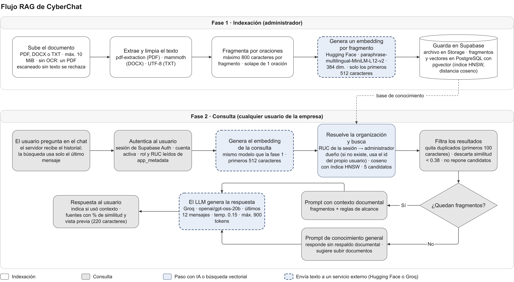

# Flujo RAG — CyberChat

CyberChat usa **RAG (Retrieval-Augmented Generation, generación aumentada por recuperación)**:
antes de que el modelo de lenguaje responda, el sistema busca en los documentos de la empresa los
fragmentos más parecidos a la pregunta y se los entrega como contexto. Así las respuestas se basan
en las políticas reales de cada empresa y no solo en el conocimiento general del modelo.

El flujo tiene dos fases: la **indexación**, cuando el administrador sube un documento, y la
**consulta**, cada vez que alguien le pregunta algo al asistente.

| | Español | English |
|---|---|---|
| Editable (draw.io) | [flujo-rag.drawio](flujo-rag.drawio) | [flujo-rag.en.drawio](flujo-rag.en.drawio) |
| Imagen | [PNG](img/flujo-rag.es.png) · [SVG](img/flujo-rag.es.svg) | [PNG](img/flujo-rag.en.png) · [SVG](img/flujo-rag.en.svg) |

Las cuatro salidas se generan desde una sola definición con `node docs/tools/generar-diagramas.mjs`.

## Tecnologías en cada paso

| Paso | Tecnología |
|---|---|
| Extracción de texto | `pdf-extraction` (PDF), `mammoth` (DOCX) y decodificación UTF-8 (TXT). No hay OCR: un PDF escaneado sin texto se rechaza |
| Fragmentación | Por oraciones, máximo 800 caracteres por fragmento, con 1 oración de solapamiento |
| Embeddings | Hugging Face Inference · `paraphrase-multilingual-MiniLM-L12-v2`, multilingüe, 384 dimensiones. Solo se envían los primeros 512 caracteres de cada texto |
| Almacenamiento de vectores | PostgreSQL 17 + `pgvector` en Supabase, índice HNSW con distancia coseno |
| Búsqueda semántica | Función `match_document_chunks_scoped`: devuelve los 5 fragmentos más cercanos, solo de documentos de la empresa. Luego se quitan duplicados (mismos primeros 100 caracteres) y los de similitud menor a 0.38, sin reponer candidatos |
| Generación | Groq · `openai/gpt-oss-20b`, temperatura 0.15, máximo 900 tokens, con los últimos 12 mensajes de la conversación |

## Por qué funciona así

- **Mismo modelo en ambas fases.** La pregunta y los fragmentos se convierten en vectores con el
  mismo modelo; solo así la distancia entre ellos mide qué tan parecido es su significado.
- **Fragmentos por oraciones.** Cortar por oraciones completas, con una de solapamiento, evita
  partir ideas a la mitad y conserva el contexto entre fragmentos vecinos.
- **Aislamiento por empresa.** El RUC sale de `app_metadata` en la sesión del usuario, nunca de lo que
  envía el navegador, y con él se busca al administrador dueño de los documentos. Si no existe, se usa
  el id del propio usuario, así que nunca se recuperan documentos de otra empresa.
- **Solo el último mensaje busca.** El servidor recibe el historial, pero el embedding de consulta se
  genera únicamente con el último mensaje del usuario.
- **Umbral de 0.38.** Los fragmentos poco parecidos se descartan para que no desvíen la respuesta.
  Si no queda ninguno, el asistente responde con conocimiento general y lo indica.
- **Alcance limitado.** El prompt de sistema restringe al asistente a temas de ciberseguridad,
  aunque el usuario insista.
- **Fuentes visibles.** Cada respuesta muestra los fragmentos usados y su similitud, para que el
  usuario sepa en qué se basó.
