# Modelo entidad-relación — CyberChat

Diagrama de la base de datos en producción: **11 tablas** en el esquema `public` de PostgreSQL 17,
más la tabla de identidades que gestiona Supabase Auth en el esquema `auth`.

El modelo se extrajo directamente del catálogo del gestor (`information_schema.columns` y
`pg_constraint`), de modo que refleja el estado real y no el previsto.

---

## 1. Diagrama

```mermaid
%%{init: {'er': {'layoutDirection': 'LR'}}}%%
erDiagram
    auth_users {
        uuid id PK "Gestionado por Supabase Auth"
        text email UK
        jsonb raw_user_meta_data "rol, RUC, nombre y estado de aprobación"
    }

    conversations {
        uuid id PK
        uuid user_id FK "CASCADE"
        text title "Por defecto: Nuevo chat"
        timestamptz created_at
    }

    messages {
        uuid id PK
        uuid conversation_id FK "CASCADE"
        text role "CHECK: user o assistant"
        text content
        timestamptz created_at
    }

    diagnostic_results {
        uuid id PK
        uuid user_id FK "CASCADE"
        int score
        int total
        jsonb topics_performance "Aciertos por cada uno de los 8 temas"
        timestamptz completed_at
    }

    quiz_results {
        uuid id PK
        uuid user_id FK "CASCADE"
        int score
        int total
        timestamptz taken_at
    }

    evaluation_attempts {
        uuid id PK
        uuid user_id FK "CASCADE"
        text test_type "CHECK: posttest o recurrente"
        int score
        int total
        jsonb topics_performance "Aciertos por cada uno de los 8 temas"
        timestamptz taken_at
    }

    posttest_questions {
        uuid id PK
        text topic_key "Uno de los 8 temas"
        text question
        jsonb options "4 alternativas"
        int correct_index "CHECK: entre 0 y 3"
        text explanation
        bool active "Por defecto: true"
        timestamptz created_at
    }

    seen_questions {
        uuid user_id PK "También FK, CASCADE"
        uuid question_id PK "También FK, CASCADE"
        timestamptz seen_at
    }

    learning_progress {
        uuid id PK
        uuid user_id FK "CASCADE"
        text topic_key
        text status "CHECK: pendiente, en_progreso o completado"
        timestamptz updated_at
    }

    documents {
        uuid id PK
        text name
        text storage_path "Ruta en el bucket de archivos"
        uuid uploaded_by FK "Sin acción en borrado"
        timestamptz created_at
    }

    document_chunks {
        uuid id PK
        uuid document_id FK "CASCADE, admite nulo"
        text content
        int chunk_index
        vector embedding "384 dimensiones, índice HNSW"
        timestamptz created_at
    }

    org_summaries {
        uuid id PK
        text ruc "Sin integridad referencial"
        text period "CHECK: week, month, quarter o all"
        text summary_text
        jsonb warnings
        jsonb metrics
        uuid generated_by FK "SET NULL en borrado"
        timestamptz generated_at
    }

    auth_users ||--o{ conversations : "mantiene"
    auth_users ||--o{ diagnostic_results : "rinde"
    auth_users ||--o{ quiz_results : "rinde"
    auth_users ||--o{ evaluation_attempts : "rinde"
    auth_users ||--o{ learning_progress : "avanza en"
    auth_users ||--o{ documents : "sube"
    auth_users ||--o{ seen_questions : "ya respondió"
    auth_users ||--o{ org_summaries : "genera"

    conversations ||--o{ messages : "contiene"
    documents ||--o{ document_chunks : "se fragmenta en"
    posttest_questions ||--o{ seen_questions : "aparece en"
```



---

## 2. Cómo leer el diagrama

| Símbolo | Significado |
|---|---|
| `PK` | Clave primaria |
| `FK` | Clave foránea |
| `UK` | Valor único |
| `\|\|--o{` | Uno a muchos: una fila del lado izquierdo se relaciona con cero o más del derecho |
| `CASCADE` | Al borrar la fila referenciada se borran también las que dependen de ella |

`seen_questions` es una **tabla de relación**: resuelve el vínculo de muchos a muchos entre usuarios
y preguntas, y su clave primaria es la combinación de ambos identificadores. Por eso la misma pregunta
no puede registrarse dos veces para el mismo usuario.

---

## 3. Qué guarda cada tabla

| Tabla | Contenido | Volumen actual |
|---|---|---|
| `auth_users` | Identidad, credenciales y metadatos: rol, RUC, nombre y estado de aprobación | — |
| `conversations` · `messages` | Historial del asistente virtual, una conversación con sus mensajes | — |
| `diagnostic_results` | Resultado del diagnóstico inicial, uno por usuario | — |
| `quiz_results` | Resultados de evaluaciones. Tabla heredada: se mantiene con doble escritura | — |
| `evaluation_attempts` | Cada intento con su tipo y su desempeño por tema. Solo se añade, nunca se sobrescribe | — |
| `posttest_questions` | Banco fijo de preguntas del post-test y las evaluaciones recurrentes | 200 filas, 25 por tema |
| `seen_questions` | Qué preguntas ya vio cada usuario, para no repetirlas | — |
| `learning_progress` | Estado de cada tema en la ruta de aprendizaje del usuario | — |
| `documents` · `document_chunks` | Documentos de cada empresa y sus fragmentos vectorizados para la búsqueda semántica | — |
| `org_summaries` | Resúmenes generados por IA. Sirve de caché y de registro de auditoría | — |

---

## 4. Observaciones sobre el esquema

Cuatro hallazgos surgidos al extraer el modelo. Ninguno impide el funcionamiento actual, pero conviene
declararlos porque afectan la integridad de los datos.

**1 · No existe una tabla de empresas.** La empresa es el eje de todo el sistema —el aislamiento entre
organizaciones depende de ella—, pero no está modelada: el RUC vive como texto dentro de
`auth_users.raw_user_meta_data` y se repite como texto en `org_summaries.ruc`. El gestor no puede
garantizar que esos valores coincidan ni que correspondan a una empresa existente; esa consistencia
queda enteramente en manos del código de la aplicación.

**2 · `org_summaries.generated_by` es contradictorio.** La columna está declarada `NOT NULL`, pero su
clave foránea se definió con `ON DELETE SET NULL`. Si alguna vez se borra el usuario que generó un
resumen, la base intentará poner nulo un campo que no lo admite y el borrado fallará. Ambas
declaraciones son válidas por separado; juntas se anulan.

**3 · `documents.uploaded_by` no define comportamiento en borrado.** Todas las demás claves foráneas
hacia usuarios usan `CASCADE`; esta quedó sin cláusula, es decir `NO ACTION`. Borrar un usuario que
haya subido documentos fallará, mientras que borrar uno que solo rindió evaluaciones funcionará. Es una
inconsistencia de criterio, no un fallo de funcionamiento.

**4 · `document_chunks.document_id` admite nulo.** La relación con su documento no es obligatoria, de
modo que el esquema permite insertar fragmentos huérfanos. El `CASCADE` evita que se generen al borrar,
pero nada impide crearlos directamente.

---

## 5. Cómo se obtuvo

```sql
-- Columnas, tipos y valores por defecto
select table_name, ordinal_position, column_name, data_type, is_nullable, column_default
  from information_schema.columns
 where table_schema = 'public'
 order by table_name, ordinal_position;

-- Claves primarias, foráneas, únicas y restricciones de verificación
select con.contype, rel.relname, con.conname, pg_get_constraintdef(con.oid)
  from pg_constraint con
  join pg_class rel on rel.oid = con.conrelid
  join pg_namespace ns on ns.oid = rel.relnamespace
 where ns.nspname = 'public' and con.contype in ('p','f','u','c')
 order by rel.relname;
```

> **Nota sobre el nombre `auth_users`.** La tabla real es `auth.users`, en el esquema `auth` que
> administra Supabase. Mermaid no admite el punto en el nombre de una entidad, de modo que en el
> diagrama figura como `auth_users`. Se incluye porque es el destino de ocho de las once claves
> foráneas del modelo: sin ella, el diagrama quedaría desconectado.
