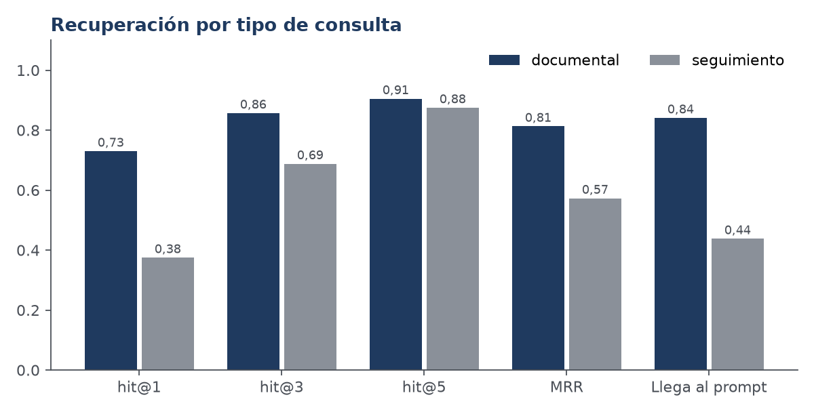
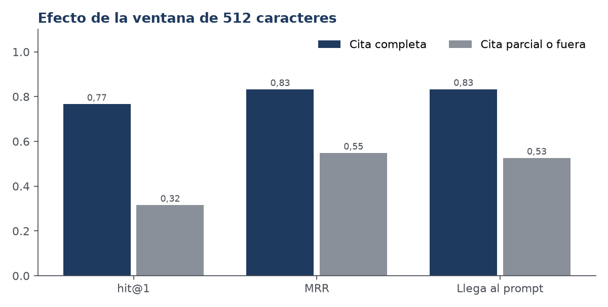
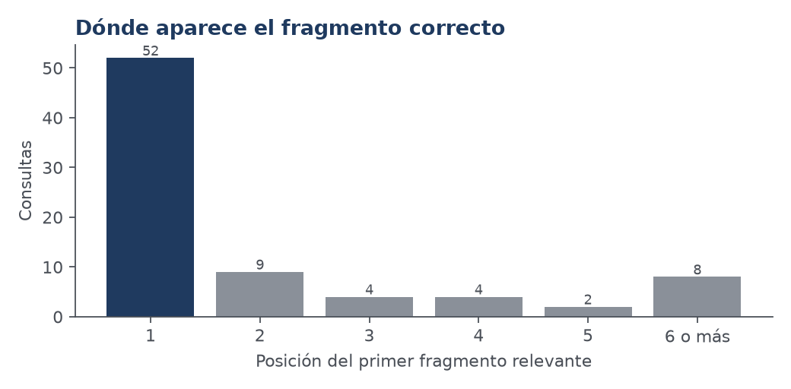
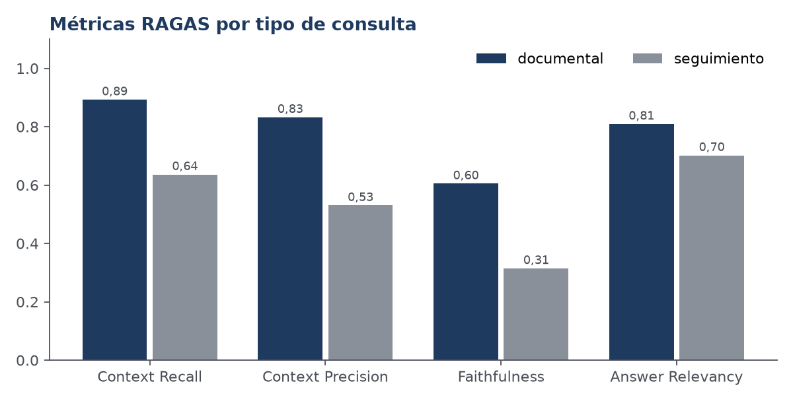

# Informe de la corrida E0-20261004T230253-6526ce2

## 1. Identificación

| Dato | Valor |
|---|---|
| Configuración | E0 — Línea base: los parámetros que corren en producción (lib/ragPipeline.ts). collect.ts recha |
| Generador | openai/gpt-oss-20b (temperatura 0.15) |
| Commit | `6526ce2867` (árbol con cambios sin commitear) |
| `corpus_hash` | `02c01b93223d16f2…` |
| `index_hash` | `c8d6cf4bcd4fef2f…` |
| Juez RAGAS | qwen/qwen3.8-27b |
| Registros | 330 (7 con error) |

## 2. Denominadores

- Conjunto principal: **80 consultas**, 240 registros (3 repeticiones).
- Registros con error del sistema evaluado: **7** (generacion: 4, embedding: 3).
- Consultas sin ningún fragmento sobre el umbral: **9** (Q02, Q05, Q09, Q10, Q14, Q69, Q72, Q79, Q80). En esos casos el chat responde sin documentos y RAGAS no puntúa la fidelidad.

- Respuestas puntuadas por el juez: **206**; sin puntuar: **34**.

## 3. Recuperación

Relevante = fragmento que contiene la cita de `expected_evidence`. Una recuperación por consulta.

| Grupo | Consultas | hit@1 | hit@3 | hit@5 | MRR | nDCG@5 | Llega al prompt |
|---|---|---|---|---|---|---|---|
| todas | 79 | 0,66 | 0,82 | 0,90 | 0,76 | 0,78 | 0,76 |
| documental | 63 | 0,73 | 0,86 | 0,91 | 0,81 | 0,81 | 0,84 |
| seguimiento | 16 | 0,38 | 0,69 | 0,88 | 0,57 | 0,64 | 0,44 |

Cada empresa tiene pocos fragmentos, así que hit@10 es casi trivial y no se informa como resultado.

### Efecto de la ventana de 512 caracteres

| Cita relevante | Consultas | hit@1 | MRR | Llega al prompt |
|---|---|---|---|---|
| completa dentro de la ventana | 60 | 0,77 | 0,83 | 0,83 |
| parcial o fuera | 19 | 0,32 | 0,55 | 0,53 |

Asociación observada, sin controlar otras causas (los fragmentos largos pueden ser más genéricos).

## 4. Métricas RAGAS

| Métrica | Todas | Documental | Seguimiento | n |
|---|---|---|---|---|
| Context Recall | 0,85 | 0,89 | 0,64 | 70 |
| Context Precision | 0,78 | 0,83 | 0,53 | 70 |
| Faithfulness | 0,56 | 0,60 | 0,31 | 206 |
| Answer Relevancy | 0,79 | 0,81 | 0,70 | 206 |

> **Cautela.** Un solo juez, una sola ejecución y sin intervalos de confianza. Faithfulness no está validada contra la revisión humana (`human_review.py`); no debe citarse como resultado hasta entonces.

## 5. Aislamiento entre organizaciones

- Registros evaluados: 30. Fragmentos ajenos en el prompt: **0**; entre los candidatos ampliados: **0**.
- La copia de texto en las respuestas se revisa con `isolation_check.py`.
