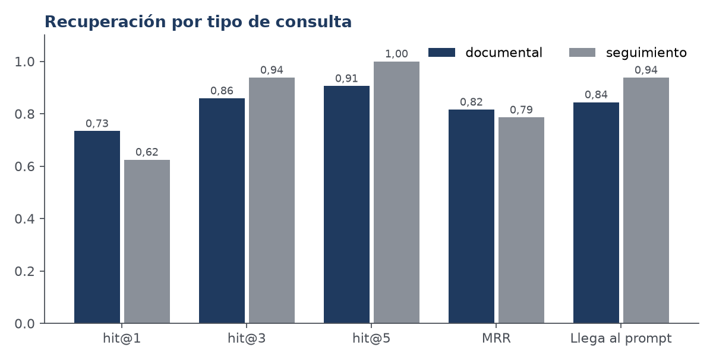
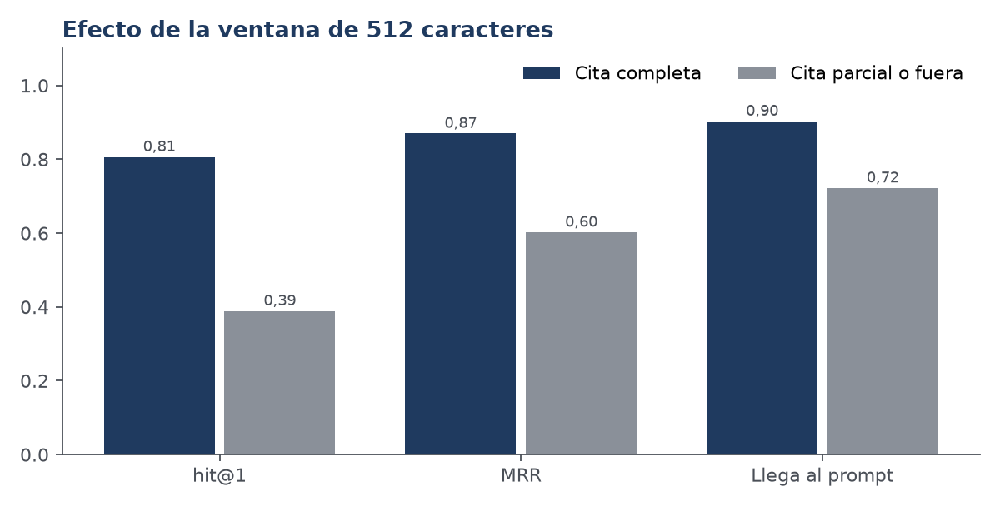
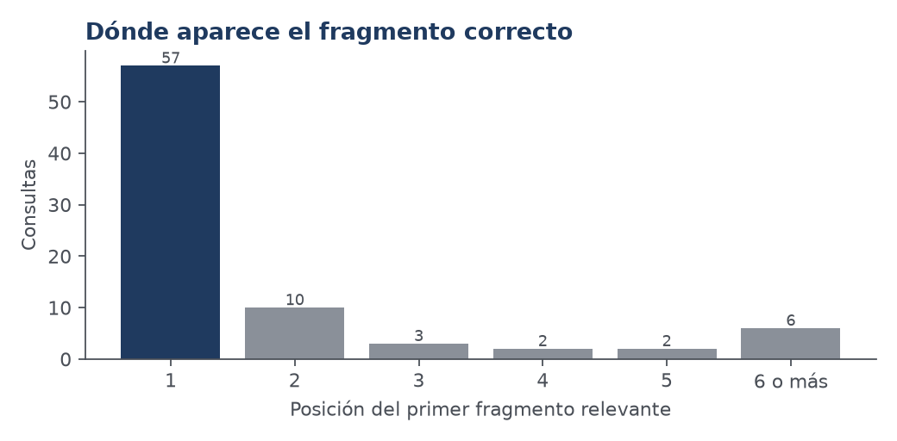
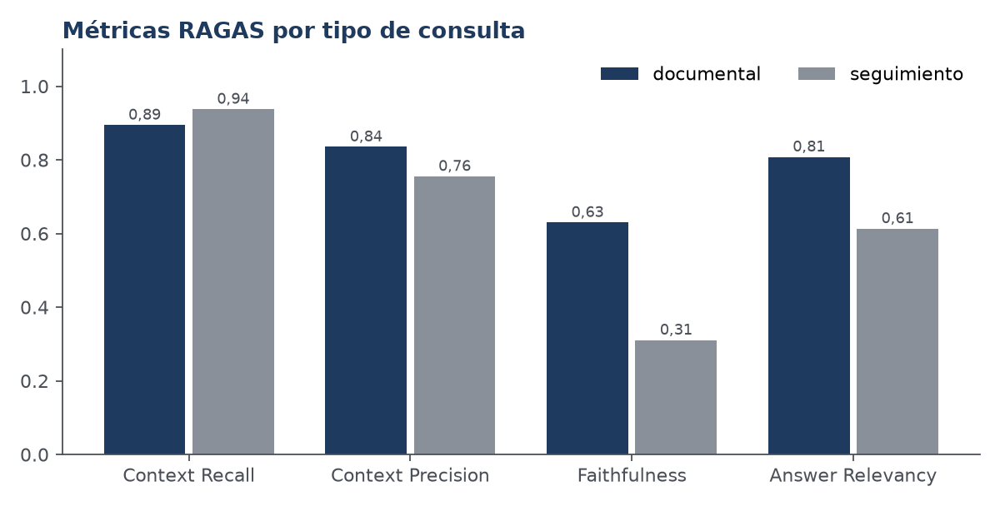

# Informe de la corrida E2-20261005T005204-2dd3816

## 1. Identificación

| Dato | Valor |
|---|---|
| Configuración | E2 — Reescritura de la consulta con el historial antes de buscar (solo si hay historial). Umbra |
| Generador | openai/gpt-oss-20b (temperatura 0.15) |
| Commit | `2dd3816cb3` |
| `corpus_hash` | `02c01b93223d16f2…` |
| `index_hash` | `c8d6cf4bcd4fef2f…` |
| Juez RAGAS | qwen/qwen3.8-27b |
| Registros | 110 (0 con error) |

## 2. Denominadores

- Conjunto principal: **80 consultas**, 80 registros (3 repeticiones).
- Registros con error del sistema evaluado: **0**.
- Consultas sin ningún fragmento sobre el umbral: **4** (Q02, Q05, Q14, Q72). En esos casos el chat responde sin documentos y RAGAS no puntúa la fidelidad.

- Respuestas puntuadas por el juez: **76**; sin puntuar: **4**.

## 3. Recuperación

Relevante = fragmento que contiene la cita de `expected_evidence`. Una recuperación por consulta.

| Grupo | Consultas | hit@1 | hit@3 | hit@5 | MRR | nDCG@5 | Llega al prompt |
|---|---|---|---|---|---|---|---|
| todas | 80 | 0,71 | 0,88 | 0,93 | 0,81 | 0,81 | 0,86 |
| documental | 64 | 0,73 | 0,86 | 0,91 | 0,82 | 0,81 | 0,84 |
| seguimiento | 16 | 0,62 | 0,94 | 1,00 | 0,79 | 0,82 | 0,94 |

Cada empresa tiene pocos fragmentos, así que hit@10 es casi trivial y no se informa como resultado.

### Efecto de la ventana de 512 caracteres

| Cita relevante | Consultas | hit@1 | MRR | Llega al prompt |
|---|---|---|---|---|
| completa dentro de la ventana | 62 | 0,81 | 0,87 | 0,90 |
| parcial o fuera | 18 | 0,39 | 0,60 | 0,72 |

Asociación observada, sin controlar otras causas (los fragmentos largos pueden ser más genéricos).

## 4. Métricas RAGAS

| Métrica | Todas | Documental | Seguimiento | n |
|---|---|---|---|---|
| Context Recall | 0,90 | 0,89 | 0,94 | 76 |
| Context Precision | 0,82 | 0,84 | 0,76 | 76 |
| Faithfulness | 0,56 | 0,63 | 0,31 | 76 |
| Answer Relevancy | 0,77 | 0,81 | 0,61 | 76 |

> **Cautela.** Un solo juez, una sola ejecución y sin intervalos de confianza. Faithfulness no está validada contra la revisión humana (`human_review.py`); no debe citarse como resultado hasta entonces.

## 5. Aislamiento entre organizaciones

- Registros evaluados: 10. Fragmentos ajenos en el prompt: **0**; entre los candidatos ampliados: **0**.
- La copia de texto en las respuestas se revisa con `isolation_check.py`.

## 6. Comparación con la línea base

| Candidata | Métrica | n | Base | Cand. | Dif. | IC 95 % | p Holm |
|---|---|---|---|---|---|---|---|
| E1 | hit@1 | 79 | 0,658 | 0,658 | +0.000 | [+0.000, +0.000] | 1,0000 |
| E1 | hit@3 | 79 | 0,823 | 0,823 | +0.000 | [+0.000, +0.000] | 1,0000 |
| E1 | hit@5 | 79 | 0,899 | 0,899 | +0.000 | [+0.000, +0.000] | 1,0000 |
| E1 | mrr | 79 | 0,764 | 0,764 | +0.000 | [+0.000, +0.000] | 1,0000 |
| E1 | ndcg@5 | 79 | 0,777 | 0,777 | +0.000 | [+0.000, +0.000] | 1,0000 |
| E1 | produccion_hit | 79 | 0,759 | 0,835 | +0.076 | [+0.025, +0.139] | 0,5938 |
| E1 | context_recall | 69 | 0,850 | 0,894 | +0.043 | [+0.000, +0.101] | 1,0000 |
| E1 | context_precision | 69 | 0,782 | 0,794 | +0.012 | [+0.000, +0.027] | 0,7421 |
| E1 | faithfulness | 68 | 0,556 | 0,573 | +0.016 | [-0.025, +0.060] | 1,0000 |
| E1 | answer_relevancy | 69 | 0,795 | 0,790 | -0.004 | [-0.035, +0.021] | 1,0000 |
| E2 | hit@1 | 79 | 0,658 | 0,709 | +0.051 | [-0.013, +0.114] | 1,0000 |
| E2 | hit@3 | 79 | 0,823 | 0,873 | +0.051 | [+0.013, +0.101] | 1,0000 |
| E2 | hit@5 | 79 | 0,899 | 0,924 | +0.025 | [+0.000, +0.063] | 1,0000 |
| E2 | mrr | 79 | 0,764 | 0,807 | +0.043 | [+0.006, +0.089] | 0,7813 |
| E2 | ndcg@5 | 79 | 0,777 | 0,812 | +0.036 | [+0.002, +0.077] | 1,0000 |
| E2 | produccion_hit | 79 | 0,759 | 0,861 | +0.101 | [+0.038, +0.165] | 0,1562 |
| E2 | context_recall | 70 | 0,852 | 0,910 | +0.057 | [+0.014, +0.114] | 0,7735 |
| E2 | context_precision | 70 | 0,785 | 0,824 | +0.039 | [-0.007, +0.096] | 1,0000 |
| E2 | faithfulness | 70 | 0,562 | 0,573 | +0.011 | [-0.024, +0.046] | 1,0000 |
| E2 | answer_relevancy | 70 | 0,792 | 0,782 | -0.010 | [-0.037, +0.014] | 1,0000 |

\* significativa tras la corrección de Holm (alfa 0,05).
